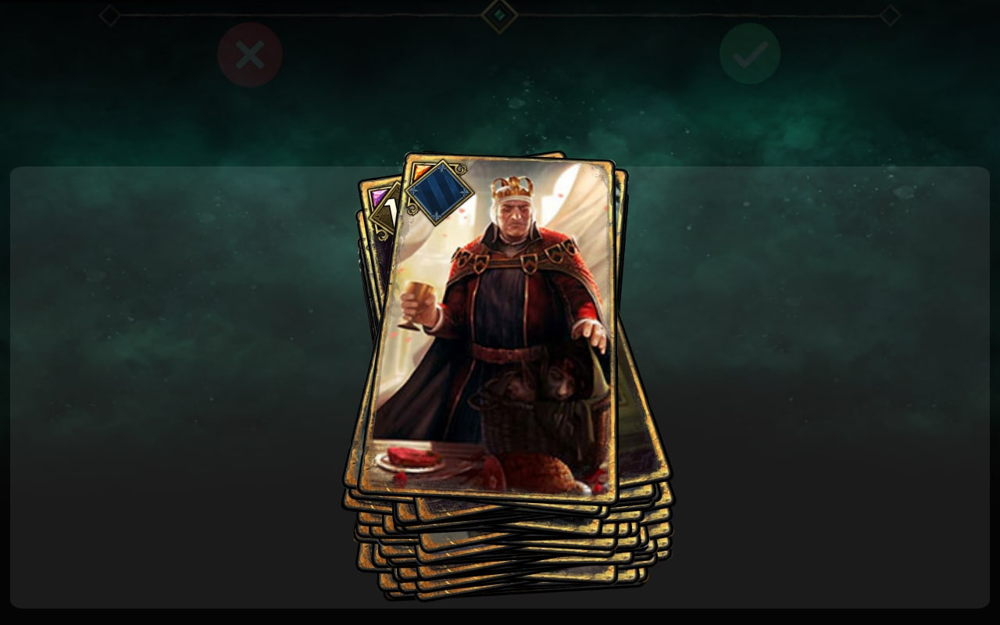
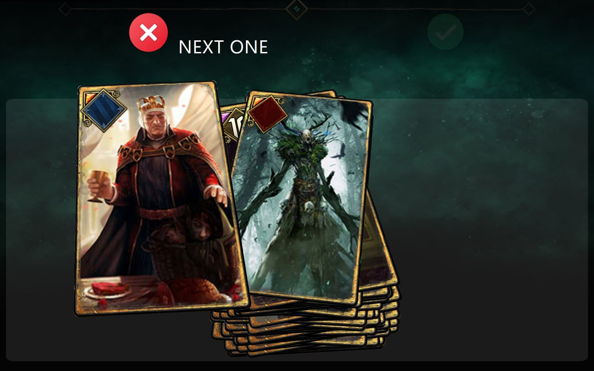
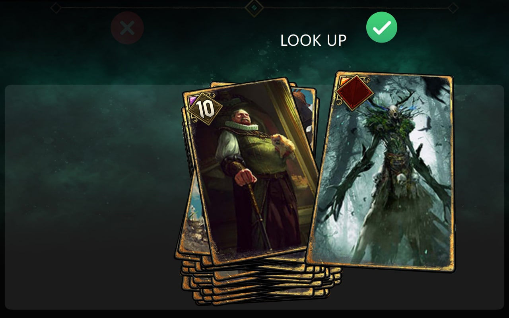
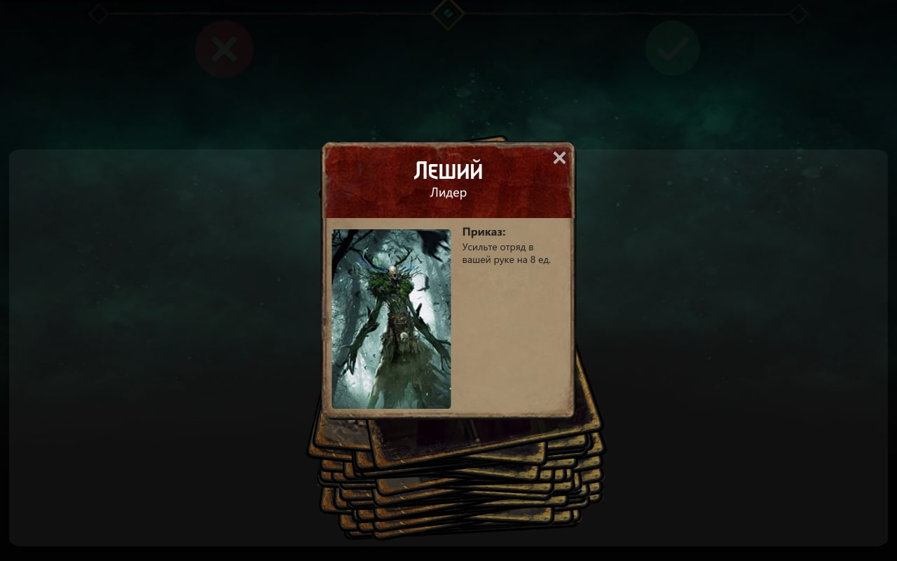
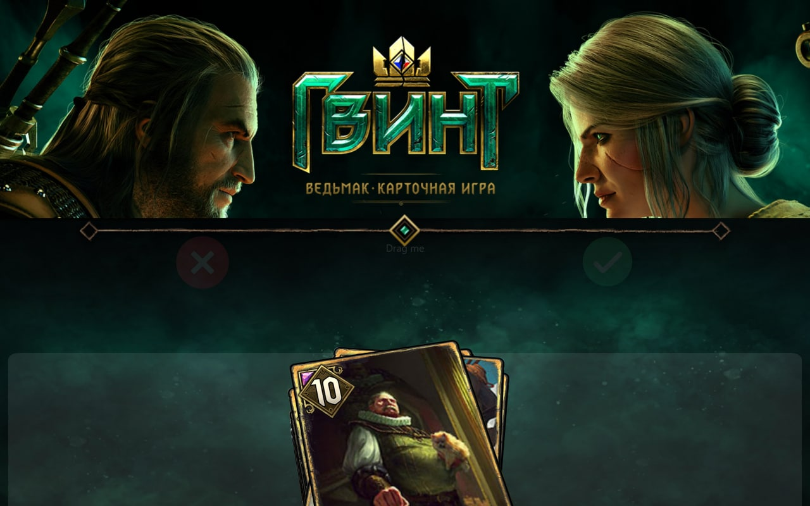
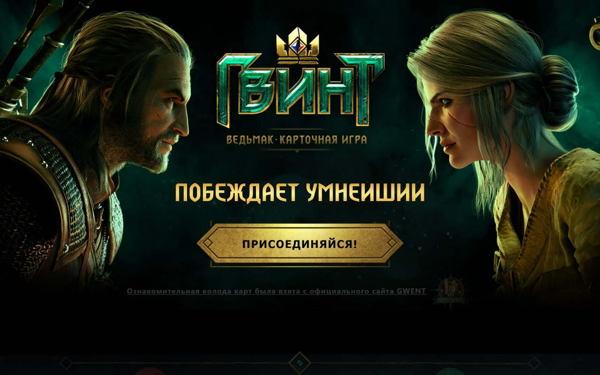

  <h1> Gwent Intro Deck </h1>

<h3> Тык на картинки: </h3>

<h2> <b> <a href="https://daniilboyarinkov.github.io/Gwent-Intro-Deck"> Ссылка на проект </a> </b> </h2>

Used:

- React
- React-Spring
- Use-Gesture

Also used:

- Eslint
- Prettier

<h3> <b> <a href="https://daniilboyarinkov.github.io/Card-Swiper/"> Ссылка на "скелет" проекта </a> </b> </h3>

Gwent Links:

---

- [Join](https://www.playgwent.com/ru/join)
- [Introductory Deck](https://www.playgwent.com/ru/card-reveals)

---

> I'm just learning
